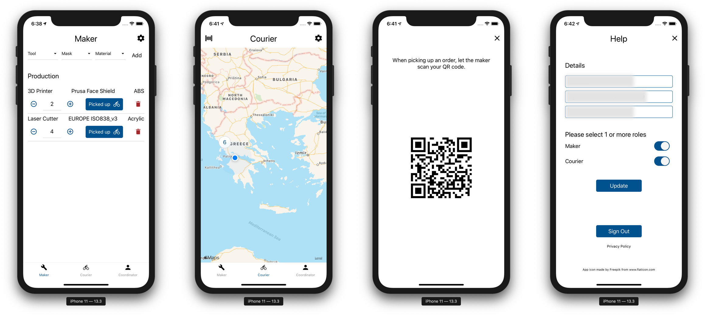

# Shield App
This is a prototype app created with React Native. It was created to help organize local maker communities that are producing any kind of face masks/shields during the COVID-19 pandemic.



## Setup
To build the app follow the steps below:

1. Clone the repo
2. Run `npm install` or `yarn`, if you use yarn
3. iOS: `cd ios && pod install`

### API keys
The app uses Firebase Auth, Firebase Realtime Database and Google Maps services. To setup all the required credentials and API keys see below.

#### Firebase

Follow the Setup guide for each platform below:

[Android guide](https://github.com/react-native-community/google-signin/blob/master/docs/android-guide.md)

[iOS Guide](https://github.com/react-native-community/google-signin/blob/master/docs/ios-guide.md)

Make sure that Google is enable in the [providers](https://console.firebase.google.com/project/_/authentication/providers) panel in Firebase Console. Then copy the `webClientId` and add it to the appropriate field in `src/appData.js`.

Make sure you don't miss [this step](https://github.com/react-native-community/google-signin/blob/master/docs/ios-guide.md#3-xcode-configuration).

### Google Maps (Android only)
Obtain an API key for Google Maps SDK for Android and add it the AndroidManifest located at `android/app/src/main/AndroidManifest.xml`.

### Tools / Masks / Materials
You can change which tools are supported by our maker community by changing the field in `src/appData.js`.

Example:

```
export const toolTypes = [
  { value: '3D Printer' },
  { value: 'Laser Cutter' },
]

export const maskModels = [
  { value: 'EUROPE ISO838_v3' },
  { value: 'Prusa Face Shield' },
  { value: 'Shield Only' },
  { value: 'Other' },
]

export const materials = [
  { value: 'PLA' },
  { value: 'ABS' },
  { value: 'PETG' },
  { value: 'Polycarbonate' },
  { value: 'Acrylic' },
  { value: 'Other' },
]
```
## Development
To test the app run the following commands:

* iOS: `npx react-native run-ios`
* Android: `npx react-native run-android`

#### iOS
During you need to set `NSAllowsArbitraryLoads` to `true` in `Info.plist`.
But before releasing the app you need to switch it back to `false`, otherwise it will rejected by the App Store.

## Production - Firebase
Before publishing your app make sure to update your Firebase Realtime Database secutiry rules.
For more information read the [official documentation](https://firebase.google.com/docs/rules).

## Attributions
App icon made by [Freepik](https://www.flaticon.com/authors/freepik) from [www.flaticon.com](www.flaticon.com)

## License
MIT License

Copyright (c) 2020 BAUD LTD

Permission is hereby granted, free of charge, to any person obtaining a copy
of this software and associated documentation files (the "Software"), to deal
in the Software without restriction, including without limitation the rights
to use, copy, modify, merge, publish, distribute, sublicense, and/or sell
copies of the Software, and to permit persons to whom the Software is
furnished to do so, subject to the following conditions:

The above copyright notice and this permission notice shall be included in all
copies or substantial portions of the Software.

THE SOFTWARE IS PROVIDED "AS IS", WITHOUT WARRANTY OF ANY KIND, EXPRESS OR
IMPLIED, INCLUDING BUT NOT LIMITED TO THE WARRANTIES OF MERCHANTABILITY,
FITNESS FOR A PARTICULAR PURPOSE AND NONINFRINGEMENT. IN NO EVENT SHALL THE
AUTHORS OR COPYRIGHT HOLDERS BE LIABLE FOR ANY CLAIM, DAMAGES OR OTHER
LIABILITY, WHETHER IN AN ACTION OF CONTRACT, TORT OR OTHERWISE, ARISING FROM,
OUT OF OR IN CONNECTION WITH THE SOFTWARE OR THE USE OR OTHER DEALINGS IN THE
SOFTWARE.